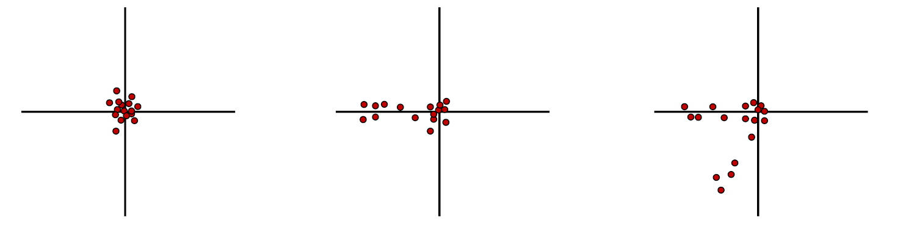
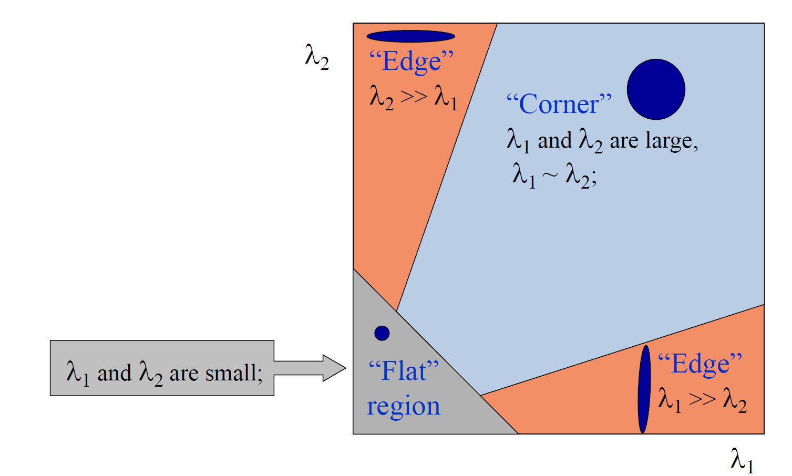

我们说，所有计算机视觉的问题都可以被转化为对应关系的问题。我们所说的对应关系的典型例子就是两张图中点与点的对应关系。找点与点之间的对应关系被称为特征匹配（feature matching）问题，它的应用是非常广泛的，在后续的课程中也会一遍又一遍地出现。

特征匹配主要分以下三步：
1. 检测（detection），检测一些特征点（feature points / interest points）。
2. 描述（description），对每个特征点给出一个描述子（descriptor）。
3. 匹配（matching），确定描述子之间的对应关系。
我们来逐一讨论这些过程。

## 检测（detection）

显然，匹配一张图片中的所有像素是不现实的，而且很多像素的辨识度（唯一性，uniqueness）也不够强。因此，我们要使用唯一性比较好的特征点。如何去描述一个像素的唯一性？这是我们需要讨论的问题。

首先，我们考虑局部的唯一性。对于每个点，我们想要匹配的事实上是一个邻域。对于下图中的这样一个小方框，我们要求，随便怎么移动这个窗口，其中的内容都会发生显著的改变。因此，自然而然地我们就想到角点作为一个很好的特征，也就是其中的第三种。

我们来观察一下怎么定量计算，很自然地我们想到梯度向量作为标准。将每个梯度向量画在二维平面上，我们得到这样的结果：

那么我们会自然而然地想到一种数学工具，也就是主成分分析（principal component analysis, PCA）。二维图像中的主成分指的就是图像中分布比较散的方向和它的垂直方向，我们计算三种情形的主成分：

当两个主成分都很大的时候，我们就发现它是一个角点。那么，我们就得到了一个计算方法：
1. 对数据点进行中心化；
2. 计算协方差矩阵；
3. 进行特征值分解；
4. 考虑特征值的大小，得到：

但是，这种方式还是显得有点复杂，我们直接考虑 Harris 角点检测器（Harris corner detector）

$$
f = \frac{\lambda_1\lambda_2}{\lambda_1 + \lambda_2} = \frac{\det \mathrm{Cov}}{\mathrm{Tr\ }\mathrm{Cov}}
$$

其中 $\mathrm{Cov}$ 为协方差矩阵，$f$ 被称为角点响应（corner response）。

这样的话，我们就可以计算角点的响应值图，对这个图做二值化，就可以得到可能的角点，从而计算出特征点。

我们的另一个要求是，特征点需要有可重复性（repeatability）。我们需要做的是匹配两个图，而我们检测的两组点是在两个图上分别检测的。因此，我们需要保证检测出来的点在另外一张图上也能被一样地检测出来。如何衡量可重复性？我们只要要求响应值在图像变换之后保持不变。在这里，我们指的图像变换可能是光度（photometric）变换，例如亮度变化以及几何（geometric）变换，例如旋转和放缩。

???+ error 
    未完成！