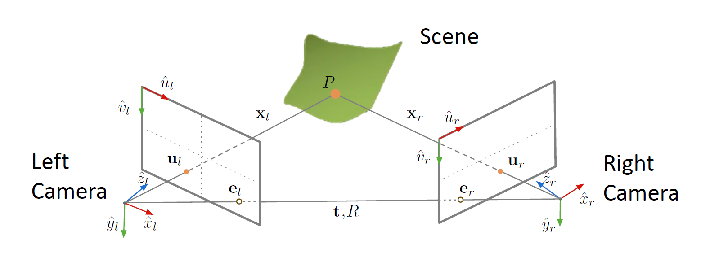

从这里开始，我们的任务就是从运动中还原结构。这个过程就被称为 运动恢复结构（Structure from Motion, SfM）。这里提到的 motion 是相机的运动。使用相机从各个角度拍摄图像，我们希望计算出这些图像拍摄时相机在三维空间中的位置和朝向，或者称之为相机的位姿。

相关的问题主要有几种拓展。一方面是多视图立体匹配（Multi-view Stereo, MVS），它帮助我们构建一种稠密点云；一方面是视觉定位（Visual Localization），它要求我们定位拍照的范围。另一个重要应用是实时定位与映射（Simultaneous Localization and Mapping, SLAM），它要求实时完成重建和定位。

在这个问题上，我们需要明确几个问题：
1. 相机怎么将三维的点映射到二维平面（相机模型）
2. 如何计算相机的位置和方向（相机标定和位姿估计）
3. 如何重建未知的三维模型
接下来我们注意考察这些方面。

## 相机模型（camera model）

我们知道，在图像形成过程中，我们把相机放在某个位置，然后按下快门，通过光电转换来实现最后的成像，如下图：

在这个过程中，每一步都发生了一个变换：
1. 将世界坐标系转换到世界坐标系；
2. 投影到图像平面；
3. 图像平面上的物理坐标往像素坐标的映射。
这三步构成了一个完整的相机模型。第一个变换对应的矩阵被称为外参矩阵（extrinsic matrix），它只与相机的位姿有关；第二第三个变换对应的矩阵被称为内参矩阵（intrinsic matrix），它只与相机的内部参数有关。

第一步是一个坐标系的转换。我们首先需要知道相机在世界坐标系中的位置与朝向，我们将前者用一个向量 $c_w$ 表示，将后者用一个旋转矩阵 $R$ 表示，它们被统称为外参（extrinsic parameters），如下图：

这个三维空间中的旋转矩阵的概念如下图：

当然，它也是一个正交矩阵，也就是说，$R^TR=I$。于是，我们得到的变换就是：

$$
x_c = R(x_w - c_w) = Rx_w - Rc_w = Rx_w + t
$$

其中 $t = -Rc_w$。

在齐次坐标系下，它就可以被表达成一个线性的形式，记：

$$
M_{\mathrm{ext}} = \begin{bmatrix}
R & t\\
0 & 1
\end{bmatrix}
$$

称为外参矩阵（extrinsic matrix），我们就有：

$$
\tilde x_c = M_{\mathrm{ext}}\tilde x_w
$$

投影矩阵我们已经知道了：

$$
x_i = f\hat x_c
$$

其中 $\hat x_c$ 为最后一维被归一化的齐次坐标。

在第三步中，我们需要注意一次平移操作，将图像中心平移，如下图：

在齐次坐标系中，我们就有内参矩阵：

$$
M_{\mathrm{int}} = \begin{bmatrix}
f_x & 0 & c_x & 0\\
0 & f_y & c_y & 0\\
0 & 0 & 1 & 0
\end{bmatrix}
$$

其中 $f_x = m_x f$，$f_y = m_y f$，它们可以被理解为以像素计算的焦距。

综合上面两个矩阵，我们就能获得：

$$
\tilde u = M_{\mathrm{int}}M_{\mathrm{ext}}\tilde x_w = P\tilde x_w
$$

这时我们就得到了一个完整的相机模型。比起最开始的相机模型，它只是增加了一些更加细节的参数。我们的下一个问题是，怎么获得这些所需的参数？这时我们就需要用到相机标定（camera calibration）技术。

## 相机标定（camera calibration）

当然，我们的内参可以是已知的，也就是相机的出厂参数，但是，这个参数可能并不标准。但是，外参一定是未知的，必须从图像去反求出来，这个过程就称为相机标定。

在相机标定的过程中，我们首先假定我们拍摄的物体结构是已知的。例如，使用一块标定板（calibration board），如下图：

通过这样一块标定板上的点和图像坐标系之间的映射，就可以求出相机的内外参矩阵。

对于每个匹配点，我们都有：

$$
\begin{bmatrix}
u^{(i)}\\v^{(i)}\\1
\end{bmatrix}
\equiv
\begin{bmatrix}
p_{11} & p_{12} & p_{13} & p_{14}\\
p_{21} & p_{22} & p_{23} & p_{24}\\
p_{31} & p_{32} & p_{33} & p_{34}
\end{bmatrix}
\begin{bmatrix}
x_w^{(i)}\\
y_w^{(i)}\\
z_w^{(i)}\\
1
\end{bmatrix}
$$

然后将其展开成线性方程：

$$
\begin{array}{cc}
u^{(i)} &= \dfrac{p_{11}x_w^{(i)} + p_{12}y_w^{(i)} + p_{13}z_w^{(i)} + p_{14}}{p_{31}x_w^{(i)} + p_{32}y_w^{(i)} + p_{33}z_w^{(i)} + p_{34}}\\
v^{(i)} &= \dfrac{p_{21}x_w^{(i)} + p_{22}y_w^{(i)} + p_{23}z_w^{(i)} + p_{24}}{p_{31}x_w^{(i)} + p_{32}y_w^{(i)} + p_{33}z_w^{(i)} + p_{34}}
\end{array}
$$

重排之后得到：

$$
\begin{bmatrix}
x_w^{(1)} & y_w^{(1)} & z_w^{(1)} & 1 & 0 & 0 & 0 & 0 & -u_1x_w^{(1)} & -u_1y_w^{(1)} & -u_1z_w^{(1)} & -u_1\\
0 & 0 & 0 & 0 & x_w^{(1)} & y_w^{(1)} & z_w^{(1)} & 1 & -v_1x_w^{(1)} & -v_1y_w^{(1)} & -v_1z_w^{(1)} & -v_1\\
\vdots & \vdots & \vdots & \vdots & \vdots & \vdots & \vdots & \vdots & \vdots & \vdots & \vdots & \vdots\\
x_w^{(i)} & y_w^{(i)} & z_w^{(i)} & 1 & 0 & 0 & 0 & 0 & -u_ix_w^{(i)} & -u_iy_w^{(i)} & -u_iz_w^{(i)} & -u_i\\
0 & 0 & 0 & 0 & x_w^{(i)} & y_w^{(i)} & z_w^{(i)} & 1 & -v_ix_w^{(i)} & -v_iy_w^{(i)} & -v_iz_w^{(i)} & -v_i\\
\vdots & \vdots & \vdots & \vdots & \vdots & \vdots & \vdots & \vdots & \vdots & \vdots & \vdots & \vdots\\
x_w^{(n)} & y_w^{(n)} & z_w^{(n)} & 1 & 0 & 0 & 0 & 0 & -u_nx_w^{(n)} & -u_ny_w^{(n)} & -u_nz_w^{(n)} & -u_n\\
0 & 0 & 0 & 0 & x_w^{(n)} & y_w^{(n)} & z_w^{(n)} & 1 & -v_nx_w^{(n)} & -v_ny_w^{(n)} & -v_nz_w^{(n)} & -v_n
\end{bmatrix}
\begin{bmatrix}
p_{11} \\ p_{12} \\ p_{13} \\ p_{14}\\
p_{21} \\ p_{22} \\ p_{23} \\ p_{24}\\
p_{31} \\ p_{32} \\ p_{33} \\ p_{34}
\end{bmatrix}
= 0
$$

也就是要解一个方程

$$
Ap=0
$$

但是，稍等，我们发现这玩意是多解的！从齐次坐标系的角度，乘以一个系数并不会改变投影的结果，也就是说，所有 $kP$ 和 $P$ 得出的结果都是等价的，我们说，这个 $P$ 是 defined only up to a scale，因此，我们还需要添加额外的约束。这个问题也可以形象地描述，同时对相机坐标系和世界坐标系进行拉伸不会影响结果，如图：

那么，添加什么约束呢？我们可以令 $p_{34} = 1$，也可以令 $\Vert p \Vert^2 = 1$，这样都能起到好的效果，而后者往往是更常用的。因此，我们就可以把求解转化成一个优化问题：

$$
\min_p\Vert Ap\Vert^2 \text{ s.t. } \Vert p \Vert^2 = 1
$$

通过简单的奇异值分解，我们可以证明，$p$ 就是矩阵 $A^TA$ 的最小特征值对应的特征向量时，这个条件可以被满足。然后我们将 $p$ 重排一下，得到所需的矩阵 $P$。

接下来，我们需要将 $P$ 解耦合成内参矩阵和外参矩阵，注意到，我们的矩阵可以表达成：

$$
\begin{bmatrix}
p_{11} & p_{12} & p_{13}\\
p_{21} & p_{22} & p_{23}\\
p_{31} & p_{32} & p_{33}
\end{bmatrix}
=
\begin{bmatrix}
f_x & 0 & c_x\\
0 & f_y & c_y\\
0 & 0 & 1
\end{bmatrix}
\begin{bmatrix}
r_{11} & r_{12} & r_{13}\\
r_{21} & r_{22} & r_{23}\\
r_{31} & r_{32} & r_{33}
\end{bmatrix}
=KR
$$

也就是说，我们把一个方阵分解成了一个上三角矩阵和一个正规矩阵。这也就是一个 QR 分解（QR factorization），这样得到的结果总是唯一的。

然后，我们求解平移，得到的结果就是：

$$
t = K^{-1}\begin{bmatrix}
p_{14} \\ p_{24} \\ p_34
\end{bmatrix}
$$

当然，我们相机镜头可能会引起径向和切向的畸变，这些畸变会反映在相机的内参中，在这里则已经被我们忽略了。通过同时优化这些畸变的参数，我们也可以在标定的过程中相应得到这些参数，这样会让问题变得更加复杂，但是方法是类似的。

## 视觉定位（visual localization）

我们知道，在视觉定位的过程中，我们的三维模型是一致的，因此，我们只需要使用类似的方法完成相机的定位就可以了。但是，我们的对应点并没有那么好求解，因此，我们首先需要求解三维到二维的对应关系，我们同样也使用特征匹配的方法。因为三维模型往往是从二维图像重建出来的，我们往往都有对应的二维图像。通过对数据库图像的匹配，就能得到三维到二维的对应关系。

接下来，我们就需要求解相机的外参。这时我们的相机内参往往是已知的，这个问题被称为定位问题，它与相机标定的差异就是相机内参已知。对于这样的问题，我们称为 Perspective n-Point 问题，简称 PnP 问题。这是一个纯粹的几何问题。

当然，我们的未知参数事实上是六个：三个旋转参数、三个平移参数，因此，我们通常称之为 6 个自由度的（6 Degrees of Freedom, 6DoF）位姿估计问题。原则上讲，只需要三对点就可以完成定位操作，但实践上，三对点是不够的。

当然，最简单的解法就是完全类比相机标定过程，求解投影矩阵。这个操作被称为直接线性映射方法（direct linear transform, DLT），这种方法事实上不常用，因为它浪费了已知的内参，也要求了更多的对应点。

另一种直观的方法当然就是 P3P，通过三个点来求解变换关系，也就是说，我们需要求下图中 $OA, OB, OC$ 的长度。

那么，我们开始列方程。我们知道余弦定理：

$$
\begin{array}{cc}
OA^2 + OB^2 - 2OA\cdot OB\cos\langle a, b \rangle = AB^2\\
OB^2 + OC^2 - 2OB\cdot OC\cos\langle b, c \rangle = BC^2\\
OC^2 + OA^2 - 2OC\cdot OA\cos\langle c, a \rangle = AC^2\\
\end{array}
$$

然后两边同时除 $OC^2$，记 $x = \dfrac{OA}{OC}, y = \dfrac{OB}{OC}$，得到：

$$
\begin{array}{cc}
x^2 + u^2 - 2xy\cos\langle a, b \rangle - v &= 0\\
y^2 + 1 - 2y\cos\langle b, c \rangle - uv &= 0\\
x^2 + 1 - 2x\cos\langle c, a \rangle - wv &= 0\\
\end{array}
$$

其中 $v = \dfrac{AB^2}{OC^2}, u = \dfrac{BC^2}{AB^2}, w = \dfrac{AC^2}{AB^2}$

然后把 $v$ 消掉，得到的最终结果是：

$$
\begin{array}{cc}
(1-u)y^2 - ux^2 - y\cos\langle b, c \rangle + 2uxy\cos\langle a, b \rangle + 1 = 0\\
(1-w)y^2 - wx^2 - y\cos\langle c, a \rangle + 2wxy\cos\langle a, b \rangle + 1 = 0\\
\end{array}
$$

这是一个二元二次方程组，很容易看出，它事实上有四组解。因此，我们还需要一个额外的点来确定最为可能的一组解是什么。

当然，为了处理错误匹配，我们可以使用 RANSAC 配合 P3P 来求解。

更一般地，我们可以把 PnP 问题写成优化问题，最小化重投影误差（reprojection error），也就是说：

$$
\min_{R, t} \sum_i\Vert p_i - K(RP_i + t)\Vert^2
$$

用 P3P 求解的结果作为初值，然后用 Gauss-Newton 法去进一步求解。注意，$R$ 要用三个自由度去表示，这样才能保证它的正规性约束。当然，还有一些加速算法来加快这个过程。

另一个与之相关的问题就是物体位姿估计（object pose estimation），我们要求算的就是物体在相机坐标系下的位姿，这个过程与上面提到的求解问题是完全等价的。

## 运动恢复结构（structure from motion）

直到现在，我们已经有了相机的内参。我们的步骤还是类似的：
1. 找到点到点之间的对应关系；
2. 求解两张图片之间相机之间相对的位姿；
3. 通过三角化（triangulation）找到三维点云。

当然，相对位姿的求解是一个比较麻烦的问题，我们重点来处理这个问题。也就是说，我们要探究的就是两张图像之间对应点的几何关系，这个关系由对极几何（epipolat geometry）来描述。它的基本设定如下图：

在这里，我们需要界定一些概念。极点（epipole）是一个相机在另一个相机中的投影平面中的像点，也就是上图中的 $e_l$ 和 $e_r$，它们的连线被称为基线（baseline），两个相机和场景中的点 $P$ 构成的平面被称为极平面（epipolar plane），为了描述 $u_l$ 和 $u_r$ 的关系，我们需要引入极线约束（epipolar constraint），在这里，我们给出一种推导方式。

首先，我们引入极平面的法向量 $\boldsymbol n = \boldsymbol t \times \boldsymbol x_l$ ，我们知道：

$$
\boldsymbol x_l \cdot(\boldsymbol t \times \boldsymbol x_l) = 0
$$

也就是说：

$$
\boldsymbol x_l^TT_\times\boldsymbol x_l = 0
$$

其中：

$$
T_\times = \begin{bmatrix}
0 & -t_z & t_y\\
t_z & 0 & -t_x\\
-t_y & t_x & 0
\end{bmatrix}
$$

而我们又知道两个相机之间的关系：

$$
\boldsymbol x_l = R\boldsymbol x_r + \boldsymbol t
$$

我们将这个式子带入到上面的方程中，得到：

$$
\boldsymbol x_l^TT_\times(R\boldsymbol x_r + \boldsymbol t) = 0
$$

展开：

$$
\boldsymbol x_l^T(T_\times R\boldsymbol x_r + T_\times \boldsymbol t) = 0
$$

注意到 $T_\times \boldsymbol t = t\times t = 0$，我们有：

$$
\boldsymbol x_l^TT_\times R\boldsymbol x_r = 0
$$

于是我们记 $E = T_\times R$，称其为本质矩阵（essential matrix），它也就是平移向量对应的矩阵和旋转矩阵的乘积，它取决于我们的相机之间的相对位姿。而通过奇异值分解，我们可以从 $E$ 分解出平移矩阵和旋转矩阵。

接下来，我们研究怎么求到本质矩阵 $E$。如果我知道 $\boldsymbol x_l$ 和 $\boldsymbol x_r$，那么我们就能知道 $E$。但是，我们知道在图像坐标系中的对应点。对于左边的相机，我们有：

$$
z_l \hat {\boldsymbol u}_l = K_l \boldsymbol x_l 
$$

也就是说：

$$
\boldsymbol x_l^T = K_l^{-1}z_l \hat{\boldsymbol u}_l
$$

右侧同理，我们就有：

$$
\hat{\boldsymbol u}_l^T(K_l^{-1})^TEK_r^{-1}\hat {\boldsymbol{u}}_r = 0
$$

记 $F = (K_l^{-1})^TEK_r^{-1}$ 为基础矩阵（fundamental matrix），当然，它也是 defined up to scale 的，因此，我们同样加上约束条件 $\Vert F \Vert^2 = 1$。因此，我们用类似的方式求解一个方程 $Af=0$ 即可得到基础矩阵的值。注意，这里每一对点只能给出一个方程，因此，我们至少需要八对点才能得到这样的解。

接下来，我们就可以顺理成章地获得 $E, T, R$，进而得到相机之间相对的平移与旋转。下一步就是进行三角化了。这时我们只需要求两个射线的交点，同样通过求解方程组的方式来实现。

但是这是最理想的情况。我们会注意到，这个方程组不一定有解，因为两条射线不一定有交点。因此，我们使用最小二乘解，或者使用最小化重投影误差的方法来处理：

$$
\min \Vert \boldsymbol u_l - \hat{\boldsymbol u}_l\Vert^2 + \Vert \boldsymbol u_r - \hat{\boldsymbol u}_r\Vert^2
$$

接下来，我们把两张图的情形推广到多张图上去。我们随常用的方法就是序贯式的求解方法（sequential SfM）。对于每张新的图，我们首先进行视觉定位，然后计算出新的三维点，重新优化已知的三维点中在这张图片中能够被看到的点。最后，因为存在累计误差，而且我们估计出的点都是两点处理的，所以我们需要进行一次集束调整（bundle adjustment）的操作。这时，我们使用的思路仍然是最小化重投影误差：

$$
\min\sum_{i=1}^m\sum_{j=1}^n \Vert u_j^{(i)} - P_{\mathrm{proj}}^{(i)}\boldsymbol P_j\Vert^2
$$

如图：

我们在这一步做的就是对每个点、每个相机位置，都进行重投影，然后优化总的误差，当然，这又是一个非线性的优化问题，可以用 Levenberg-Marquardt 之类的算法进行求解。