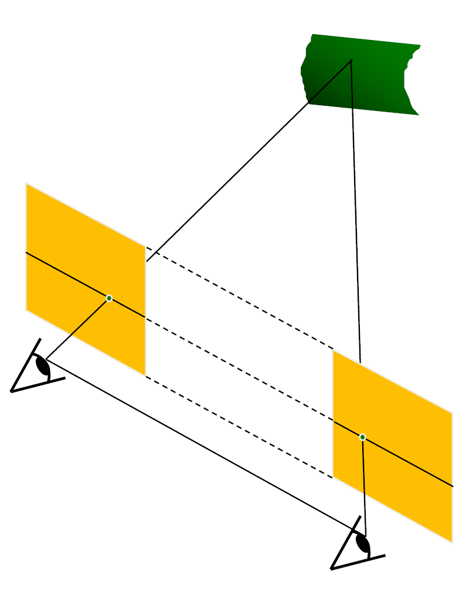

在上一次，我们已经得到了一个稀疏点云，这一次我们需要考虑怎么建立一个稠密表面，而不是一个稀疏点云，深度估计在其中就是非常重要的一个步骤。

我们说，图像的深度就是图像的某个像素离相机中心的距离。这个距离可以用深度图（depth map）来表征。注意，我们一般讲的是垂直距离，但是有的传感器给出的是斜边距离，这里在实际应用中需要特别注意。

深度估计在很多应用中都是十分重要的。例如避障过程中，深度图是一个非常重要的障碍物信息；人脸识别中，也需要深度来识别区分真正的人脸和人脸的照片。为了获取深度信息，我们的第一种方式是直接通过传感器去获取，这种方式称为主动式的深度感知（active depth sensing）。

这种传感器一般使用对环境的干涉实现。一个经典的方式是 LiDAR （light detection and ranging），通过激光的飞行时间（time of flight, ToF）来实现测距，它很贵，但是能获得非常精确的深度信息，具备高分辨率和 360 度的可见性。当然，还有结构光（structured light）和主动式的立体视觉（active stereo）。

被动式的深度感知（passive dept sensing）或者立体视觉（stereo）也是一种重要的方式。当然，后面我们会提到，单目视觉（monocular）也可以通过深度学习的一些方法去估计不精确的三维图像（[[09 3D Deep Learning]]）。这里我们主要讲立体视觉。

## 立体视觉匹配（stereo matching）

我们已经提到，最基本的方式就是首先进行匹配，然后进行三角化。这样获得的就是一个稀疏的对应关系。而如果我们想要求解一个稠密的对应关系，那么我们想到的第一个方法就是光流（optical flow），但是光流显然是不够好的，因为极线约束完全被忽略了。

最简单的情形是平行图像，如下图。其中相机的相平面互相平行，与基线也平行，同时，相机中心等高、焦距也相等，这样的话，极线就落在图像的所有水平扫描线上。这个时候的求解是简单的。

我们只需要求算两个像之间的视差。设相机间距离为 $B$，焦距为 $f$，那么我们用相似关系就能获得：

$$
x - x' = \frac{Bf}{z}
$$

其中 $z$ 为我们想求的深度值。对于不平行的情况下，我们的想法就是对图像进行重投影，使用两个单映变换（homography）来将图像投影到同一个满足这些条件的平面上，从而计算结果。

下一个问题是，找到这样的矩形免职后，我们怎么找到左边图像在右边图像上的对应点呢？我们首先假定亮度不变。当然咯，对于同一条线上的点，我们只需要最小化不相似性即可。那么，我们可选的标准有哪些呢？最基本的形式是 SSD (Sum of Squared Differences)：

$$
\sum_{x, y} \vert W_1(x, y) - W_2(x, y) \vert^2
$$

和 SAD (Sum of Absolute Differences)：

$$
\sum_{x, y}\vert W_1(x, y) - W_2(x, y)\vert
$$

但最常用的形式是 ZNCC (Zero-mean Normalized Cross Correlation)

$$
\frac{\sum_{x, y}(W_1(x, y) - \bar W_1)(W_2(x, y) - \bar W_2)}{\sigma_{W_1}\sigma_{W_2}}
$$

其中

$$
\bar W_i = \frac 1 n \sum_{x, y}W_i(x, y), \sigma_{W_i} = \sqrt{\frac 1 n \sum_{x, y}(W_i(x, y) - \bar W_i)^2}
$$

这种形式降低了亮度的影响。但是，我们的窗口越小，结果中的噪声就会越多。对于这种形式，我们就需要使用前面提到的 Markov 随机场的方法，引入这种优化形式：

$$
E(d) = E_d(d) + \lambda E_s(d)
$$

其中 $E_d(d)$ 是匹配误差，取用前面提到的所有方法，$E_s(d)$ 是光滑度度量，定义为 $\sum_{(p, q) \in N}V(d_p, d_q)$，其中 $N$ 为邻域，$V$ 为像素间的差异函数。当然，我们的 $V$ 也有多种形式，例如 $L_1$ 距离：

$$
V(d_p, d_q) = |d_p - d_q|
$$

或者 Potts model：

$$
V(d_p, d_q) = \begin{cases}
0\text{, if }d_p = d_q\\
1\text{, if }d_p \ne d_q
\end{cases}
$$

这是一个离散优化的问题，对于一条线上的情形，我们可以使用动态规划的方式求解，但是对于二维的马尔科夫随机场，我们的求解方法一般是 graph cut 或者 belief propagation 来近似求解。

这样我们就有了一个立体视觉重建的流水线：
1. 标定相机
2. 矫正图像
3. 计算视差
4. 估计深度
当然，还有一个问题是相机中心之间的距离，也就是基线的大小。如果它太小，那么深度估计的误差会很大；如果它太大，那么图像之间的匹配就会变得困难，因为两张图之间的差异就会越大。

反思这个流水线，在哪些地方容易引入误差？
1. 相机标定误差
2. 图像分辨率低
3. 遮挡（occlusion）
4. 镜面反射（specular reflection）导致的亮度一致性被破坏
5. 无纹理区域（textureless regions）导致的匹配困难

那么，我们需要想一些办法来降低匹配的难度。一种方式就是结构光（structured light），如下图，这是一种主动的深度感知。一般地，我们都会使用红外光和红外相机来做这一件事情，而且，一个相机就已经可以胜任这个任务，因为投影仪本身就可以被理解为一个相机。

## 多视图立体匹配（multi-view stereo）

在多个视图的情况下，我们可以使用多于一组图像来匹配窗口，这样我们可以获得更强的约束；同时，我们可以把各个视角融合成为一个完整的三维模型。这就是我们接下来讨论的任务。

当然，我们的想法也是一样的。对于每一张图，我们都可以得到对某个像素的一些深度估计，我们将其视作一条射线。然后，将其上的每个点都投影到其它视角上，如果这个深度估计是正确的，那么重投影误差就会比较小，这是我们基本的想法。

那么，我们怎么去很好地计算这样的误差呢？我们事实上就是要计算每个像素对应的误差曲线。我们认为，$(X, Y, D)$ 构成了一个体，我们称之为 cost volume，我们需要计算这个体上误差的取值。我们使用 plane-sweep 的方法，也就是说，我们关于等深平面进行投影，这样的投影是一个单映，于是就可以得到这样一个体上误差的取值。直观地用图像表示如下：

这种方法事实上得到的是 Markov 随机场的第一项。通过补上相邻像素之间的光滑程度衡量，就能求解 Markov 随机场得到一个好的深度图。但是，这种方法本质上还是一种穷举，其效率并不高。我们还需要思考更加高效的方法。

我们考虑 PatchMatch 的方法。前面我们对每个点都做了一次搜索，这是比较慢的，但是，我们可以引入两个假设，大量随机取样总能给出好的结果，而相邻像素块往往有相近的偏移量。基于这些假设，我们可以给出 PatchMatch 方法：

首先，我们需要计算 A 图中的三个图像块在 B 图中的位置，我们按照这样的步骤进行计算：

1. 随机初始化，对每个块给出一个随机偏移量；
2. 传播，选取相邻的图像块按照相应位置得到的结果，如果误差减小了，就把对应的偏移量赋给另一个值：例如途中我们根据红色的偏移量更新蓝色的偏移量，发现误差变小了，因此我们把红色偏移量赋给蓝色；这样我们相当于是把正确的解“扩散”出去，传播给相邻的块；
3. 对于每一个点在现在的偏移量周边做一些局部搜索，看有没有更好的解；否则的话我们得到的解就只是初始随机的结果了
4. 回到步骤 2，直到收敛。
对于深度估计，我们只需要将偏移量替换成深度值即可。

求出深度图之后，下一步我们就需要来将其重建成三维模型了。

## 三维重建（3D reconstruction）

为了完成重建，我们首先需要考虑三维数据在计算机中的表示（3D representations）。常见的三维数据表示有以下几种：

- 点云（point cloud），就是一组点。
- 体素的表示（volume），包括 occupancy 和 signed distance function (SDF)。occupancy 为每个体素（voxel）赋予一个 1 或者 0 的值表示它是否在里面，signed distance function 则给每个体素赋予距离物体表面的距离。当然，还有截断距离场（truncated SDF, TSDF），使得距离较远的地方直接设置成一个恒定值，这是更加常用的表示。但是，这种方式事实上非常占空间，因此我们一般不会使用它来构造比较精细的表示。
- 多边形网格（polygon mesh），最常用的是三角网格（triangle mesh），每个面都是三条边，这是现在最常用的一种表示，我们得到的三维模型都是这种形式的。这种表示方式可以很好地把纹理（texture）贴上去，参考 [[10 Texture]] 。

但是，在三维表面重建的过程中，我们往往通过泊松重建（Poisson reconstruction）或者 KinectFusion 的方式首先得到一个体素的表示，因为这样的表示是规则的，降噪比较方便。然后，再根据这个表示来转化成三角网格的形式。

我们首先讨论泊松重建的过程。首先，我们可以通过把深度图中的二维像素反投影到三维坐标中的方式得到一个点云，这并不困难；下一步，我们需要计算每个点的法向量，也就是说垂直于我们想要得到的表面的法向量。这一步往往是根据每个点以及其周围的点的位置来表明的，我们假设它和它周围的点可以用小的平面去拟合，然后表示出这个平面的法向量，这个过程事实上类似于主成分分析的过程，我们要求的东西可以被看成三维空间中三个主成分中较小的那一个。

接下来，我们希望把这些三维的点转化为一个三维的体素表示。我们需要构造一个示性函数 $\chi_M(p)$，也就是一个 occupancy。接下来我们需要用这个函数去逼近这堆点，首先定义目标函数：

$$
\min_\chi \Vert \nabla \chi - V\Vert
$$

也就是说让这个函数对应的梯度等于我们前面算出来的法向量。注意到，这个方程事实上就是一个泊松方程（poisson equation），接下来就可以用对应的方法（比如变分法）求解。

下一步我们考虑怎么提取出多边形网格。我们最主流的方法是 marching cubes。首先，我们考虑立方体中那些顶点值出现了征服变化的棱。然后，我们将这些棱中间插入顶点，并且把这些顶点连接成不相交的三角形。这个时候我们往往会用查找表来处理这种问题。因为最多只有 256 种类型，考虑对称性，我们事实上只要构造 15 种可能，如下图：

这个过程往往是相当快速的。

KinectFusion 主要解决的是实时的深度图融合问题。这时我们使用的是 TSDF 作为体素表示，对于每个体素 $p$ ，我们需要求算它对应的 TSDF，我们首先计算它离相机的距离，这样能将这个体素投影到像素 $u$，而我们又有在像素 $u$ 处的深度值 $D_k(u)$，那么 $D_k(u) - d_p$ 就是我们最终求得的距离。

最关键的事实上就是一个更新过程。我们考虑一个线性组合来处理这个问题：

$$
F_k(p) = \frac{W_{k-1}(p)F_k(p) + W_{D_k}(p)F_{D_k}(p)}{W_{k-1}(p) + W_{D_k}(p)}
$$

其中 $W$ 是线性组合的权重，$F_k(p)$ 为累积的 TSDF，$F_{D_k}(p)$ 是从第 $k$ 个增加的深度图得到的 TSDF。