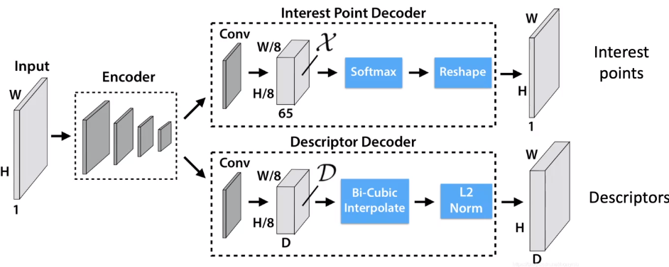
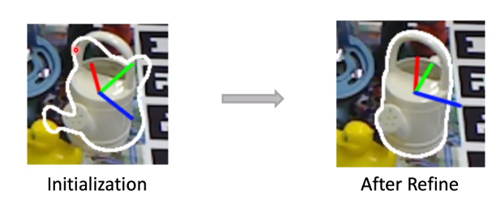
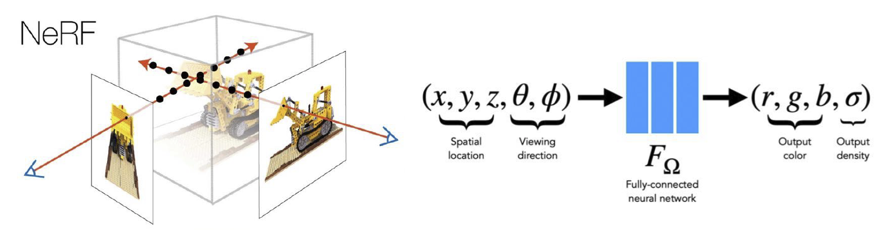

## Feature Matching 特征检测

回顾我们曾经提到过的 COLMAP 的工作流，我们需要对相机的位置进行估计，这个过程非常复杂，因此需要考虑使用神经网络来优化它。

事实上，最早的想法是利用网络去直接预测六个实数来描述相机的位置。但是后来人们发现，这样的预测会带来很大的偏差，直接用网络估计是不稳定的，而且不具备很好的泛化能力。有论文指出，网络进行的操作事实上更接近于图像检索而不是位置估计。

于是人们想到，我们利用深度学习来解决上面工作流的第一个阶段，即特征检测的步骤。考虑以前的工作流，主要有检测、描述、匹配三个步骤。它的问题在于，例如 DoG，SIFT，ORB 这样的检测子和描述子都是人为定义的，因此在极端情况下匹配的效果就会比较差。因此一个很自然的想法是，利用网络去构造并提取特征点，如图：

SuperPoint 是一个用来解决特征点和描述子的神经网络，其结构如下：

其中的检测子是基于 CNN 的，经由一个全卷积网络将所有特征点输出到一个热力图上，输入一张图片输出一张热力图。然后将响应较高的部分作为关键点。网络的另一个分支是构造描述子。一种方法是将每个点周围的图像块过一个网络并将网络的输出作为描述子，但是这个方法是比较慢的；更快的方法是，直接将经过 Encoder 网络的每个中间图像的对应点作为描述子，这样只要过一次网络就能得到所有的描述子。

下一个问题是如何训练这种网络。首先，我们通过 CNN 去检测合成的图片的角点，如图：

这样我们定义了第一个损失函数：

$$
L_{loc} = \sum_i \Vert p_t^\ast - \hat p_t\Vert^2
$$

另一个损失函数是检测可重复性的点，我们对图像进行变形，然后反复识别其中的特征点，并要求其具备可重复性，如下：

我们要求：

$$
L_{inv} = \frac 1 N \sum_{i = 1}^N \Vert f(g(I)) - g(f(I)) \Vert^2
$$

最小化，这就是第二个损失函数的定义。我们使用这两个损失函数的和进行一起优化，就可以得到最终的结果。

注意到，两者事实上分别对应了我们对特征点提取器的要求。一方面，我们要求特征点是一些角点之类的东西；另一方面，我们要求特征点具备一定的不变性。延续这样的想法，对于描述子而言，我们要求最小化真正的对应点描述子之间的距离，最大化不对应的描述子之间的距离。这样的损失函数有两种，一个是对比损失函数（contrastive loss），如下：

$$
\begin{align}{cc}
L_{pos} &= \frac 1 N \sum_{i=1}^N \Vert F_I(A) - F_{I'}(P)\Vert^2\\
L_{neg} &= \frac 1 N \sum_{i=1}^N\max(0, m - \Vert F_I(A) - F_{I'} (N)\Vert)^2
\end{align}
$$

其中 $P$ 是真正的对应点，$N$ 是不对应的点。另一种常用的形式是三元组损失：

$$
L_{tri} = \frac 1 N \sum_{i = 1}^N \max(0, m + \Vert F_I(A) - F_{I'}(P)\Vert - \Vert F_I(A) - F_{I'}(N)\Vert)^2
$$

下一个问题是，训练数据的来源是什么？这时我们的样本必须是考虑了图像之间的匹配了的。一种方式是合成图片，利用 homotopy 映射来实现；另一种方式还是通过 MVS，使用重建好的数据重新投影到多个方向，我们对它的描述子对应关系应当是相当明确的。注意，我们只使用成功的重建数据来构造神经网络，以防将错误数据引入网络。

在这个基础上，SuperGlue 使用网络来进一步学习匹配的过程。这是至今为止最好的特征匹配方法之一。

## Object Pose Estimation 物体位姿检测

我们希望识别物体相对于相机的位置和方向（3D location and orientation）。在这之前，我们首先需要定义：

1. 物体的中心；
2. 物体的坐标系；

当然，我们知道有相机坐标系，从相机坐标系到物体坐标系的旋转和平移就是我们所谓的物体位姿，如图：

类似于视觉定位的问题，我们首先找到三维到二位的对应关系，然后使用 PnP 算法来计算旋转和平移。

一个很常用的方法是基于特征匹配的方法。首先，从输入的多视角图像重建物体的 SfM 模型，然后，通过在测试图像和参考图像之间进行二维图像之前的匹配，然后抬升到三维到二维的对应关系，然后使用 PnP 方法计算旋转和平移。

另一种方法是直接姿势回归（direct pose regression），利用一个神经网络直接输出位姿，例如 PoseCNN，但是它也存在我们前面已经提到过的问题，它需要非常大量的训练数据，效果也不一定好。

还有基于关键点检测的方法。首先，我们在已经重建完成的三维模型上使用 CNN 选择一些特征点，再将这些点投影到参考图当中，然后训练一个 U-Net 在测试图像识别这些特征点，这个更类似于人体姿态估计（[[08 Recognition]]）中的热力图识别。当然，这个关键点识别网络的训练比较困难，需要较大量的数据。典型的工作是 PVNet 等。

如果我们使用上述方法预测出了一个位姿，接下来我们需要考虑如何将其弄得更准。如下图，我们根据起始的位姿可以估计出一个轮廓，根据两者之间的比较可以细化位姿。这个过程被称为位姿优化（pose refinement）。

## Human Pose Estimation 人体位姿检测

三维的人体位姿检测与传统的情形不同，它需要估计人体在三维空间中的姿态。最常用的技术手段来源于电影特效行业，称为光学动作捕捉系统（optical motion capture system, MoCap），依靠在人体上贴着的反射红外光的标记点，然后通过多个红外相机对它们的位置进行还原。

这套系统精准且快速，在现在已经非常成熟。但是它还是比较昂贵的，而且要求比较苛刻，需要在人身上贴着标记物。为了避免这些麻烦，我们可以引入无标记物光学动作捕捉系统（markerless MoCap）。直观地，人体关键点的位置检测可以使用前面讲到的一些手段完成，从而避免标记物的引入。

但是这种手段依然需要多个相机。我们也可以使用单目相机（monocular）的方式达到，这种方式的一种基本原理就是通过一个网络回归关键点的三维位置。另一种形式是使用网络回归人体参数化模型（由人体姿态参数和形变参数定义的一个网格）的姿态参数，这些参数往往是关节的角度。因为存在模型的约束，所以相对于前者来讲会更加精准一点。

## Dense Reconstruction 稠密重建

对于这个任务，传统的流水线一般就是通过 MVS，首先计算深度图，然后进行 Poisson 重建，最后将纹理贴上去。可见，在这个过程中，最麻烦的过程事实上是深度的估计。传统的深度图计算方法是由一个图在所有深度下向多个图进行投影，来计算误差函数，然后对其进行最优化。

但是这种方法存在一些局限，例如无纹理区域、反射和透明区域与大量重复纹理的区域，深度估计的误差会非常大。

因此，我们比较每张图在经过网络之后得到的特征作为描述子，而不是在传统的计算方法中误差函数计算时使用的像素值，于是就得到了所谓的 MVSNet，如下图：

注意到，它在计算深度网络时也是用了一个卷积神经网络。

另一个改进来自于渲染出来的图像和原始图像之间的对比。如果这两张图片不相同，我们是否有可能使用梯度下降来改进重建出来的网格？这是一个并不容易的问题。一方面，渲染的过程不是可微的，因此梯度的反向回传并不可行；另一方面，网格表示并不是一个适合用来完成优化的表示方式，网格顶点的位置当然可以优化，但是它的位置不能变化太大，否则容易改变网格的拓扑结构。鉴于这两点，我们首先改变三维的表示方式。

回顾三维模型的表示，基于体素的、基于点云的和基于网格的表示方式被我们称为显式的表示，而还有一种表示方式是隐式的表示，使用一个函数的等值面来表示一个形状，如下图：

事实上，我们也可以使用更加复杂的方式进行表示，例如占有性（occpupacy）和离表面的距离（signed distance function, SDF）等等。因为我们的分辨率可以无限高，所以它可以成为一个连续的函数形式，这种形式在理论上往往是非常困难的。

考虑到神经网络对函数的强表达能力，我们直接使用一个神经网络来近似它。输入的值是一个三维坐标；输出的值则是占有性或者带符号距离函数。这样的一个网络也就表达了一个物体。这类表征方法被我们称为隐式神经表示（implicit neural representation）。

利用这种方式进行重建最重要的工作是神经辐射场（Neural Radiance Fields, NeRF），它以空间位置和观察方向作为输入，以形状纹理记其强度作为输出来构成这样一个模型。我们将这种颜色和密度的场为一个辐射场，如下图：

基于这样的辐射场，我们可以使用体渲染的方式来渲染这样的一个模型。某个点上的颜色和强度就是整条线上颜色和强度的积分。利用这种方式，我们就很自然地可以得到渲染误差（rendering loss），然后对这个神经网络进行优化。

但是，对于表面模型，我们优化的结果事实上在几何上上非常差的。因为考虑到体渲染的方式，它事实上并不关心表面的几何。于是，我们通过 SDF 替换辐射场，然后在渲染的过程中重建辐射场，这个工作被称为 NeuS，其结构如下图：

类似于上面所谓三维人体估计的形式，我们还期望从单张图像去估计一个足够稠密的三维表示。单目的深度估计在无人驾驶等领域非常常见，我们试图使用网络去猜测单张图的深度，用的是一个全卷积网络。一般地，我们的训练数据可以使用 RGBD 信息采集。

当然，也可以使用单张图像估计一个三维点云或者三维网格，但是结果是相当粗糙的。

## 3D Understanding 三维识别和理解

我们还是从分类任务开始。我们知道，对于二维图像，它的表示方式是比较固定的。但是对于三维模型，它的表示方式就比较多样，例如我们已经提到的点云、网格、体素、隐式表示、多视角表示等等。对于多视角表示，我们对于每个视角下的图像过一个二维图像分类的网络，然后再做一个池化整合。这是最早的三维模型分类的思路。

但是，这种方式肯定会损失一些信息，如今我们更常用的直接从三维模型来构造的手法。非常直观的想法是，将二维的卷积扩展到三维，它可以使用在体素表示上，从而构造一个三维卷积网络（3D ConvNets）。这种方法的问题在于，时间和空间复杂度都会变得非常高，计算开销会变得难以承受。减少计算开销的思路是使用三维体素表示本身的稀疏性，即在三维空间中，被占用的比例是相当少的。因此，我们没有必要在每个位置做卷积，只需要在存在的地方做卷积。我们使用八叉树（octree）的数据结构来存储，如果没有值，则粗略地存储，如果有值，则再将其细分成八个方块存储，这是一种对稀疏结构的存储方式，我们只需要在物体表面的附近做卷积，如图：

但是，需要注意的是，对于稀疏的体素，经过一次卷积之后它就会变得比较稠密了。这样计算开销就会变得越来越巨大，效率提升还是有限的。于是，人们提出了一种称为稀疏卷积（sparse convolution）的操作，它只在输入非零的位置计算输出的卷积而不在其他区域进行计算。也就是说，对原始的输出结果抑制输入没有值的情形，如图：

这样我们就保证了输入和输出都能是稀疏的，也就构造了一种稀疏的卷积网络（Sparse ConvNet）。

对于点云而言，我们没办法在上面定义卷积。因为卷积操作要求空间是光栅化的（rasterized），也就是说将其划分成了规则的栅格。但是点云中的点具备连续的坐标值，所以它是非栅格化的（unrasterized）数据。这个领域最知名的工作之一是 PointNet，它是一种处理点云的架构，将点云标识成 N 个 D 维数据的阵列，其中 D 为点处在的维度。注意，D 不一定是 3，这一方面是因为我们可以处理二维点云，另一方面是我们也可以引入 RGB 值使它为六维的，等等。PointNet 的架构如下：

它可以被理解为一个全连接网络上的特殊设计，我们将逐一解读其中的特殊部件。一方面，注意到点云数据具备无序性，也就是说，对于 N 维度上的置换，它的输出应该具有不变性，对点的排序是任意的。而对于卷积网络，点的顺序是相当重要的。注意到，在上图的蓝色部分，我们都是对每个点做的操作，max pooling 的方式也决定了它对点的顺序是不敏感的。

另一个问题在于，我们的输入的物体位姿是不同的。也就是说，我们的点云可以发生三维空间中的全局刚体运动，而应当使得网络给出的结果不变。这在 PointNet 中是使用 Transform Net（T-Net） 解决的，这个网络是训练的一个位姿估计网络，训练过程则是和网络的其他部分同样学习的。

对于点云分割任务，它所作的就是对每个点进行分类。为了保证获得全局信息，我们将全局特征和单点特征进行堆叠，然后再进行特征提取和分类。

因为 PointNet 使用的是全局的池化，它会损失掉大量信息，我们更希望利用局部语义信息来处理问题，这方面的工作就是 PointNet++。它首先对输入进行大概的聚类，对于每个聚类中心的领域进行池化，这样可以增强网络的表示能力，其结构如下：

这种方式可以很轻松地完成三维语义分类和分割的任务。当然，三维语义分割的一种简单想法是使用多视角表示，因为往往我们使用的重建后结果已经有了清楚的多视角图像。

也可以使用这种网络来实现三维目标检测。我们会使用一个三维框来表明三维目标的位置，使用九个参数（中心位置、长宽高、旋转）。其结构如下图。当然，旋转参数有的时候可以发生简化，例如在无人驾驶中，我们只记录其中的 Yaw 角，即围绕垂直方向的旋转。

对于点云表示，当然我们可以使用滑动窗口的方法来判断，但是这样的计算开销非常大，现在往往会使用一些更加复杂的方法，例如 PointRCNN，它类似于图像情形下的 RCNN 到三位情形的扩展。

另一种形式是 Frustum PointNet，我们使用一个投影面的二维检测结果辅助做三维的检测，将结果限制在一个视锥当中来减少计算开销。

当然，也有三维的实例分割，同样有自下而上和自上而下的方法。

对于三维模型的数据集往往比较少，最初常用的是 ShapeNet，其中有大量人工合成的三维形状数据，后来还引入了 PartNet，其中增加了数据部分的标注；SceneNet 和 ScanNet 是室内场景的数据集；KITTI，Semantic KITTI 和 Waymo 则主要是无人驾驶相关的数据集。
