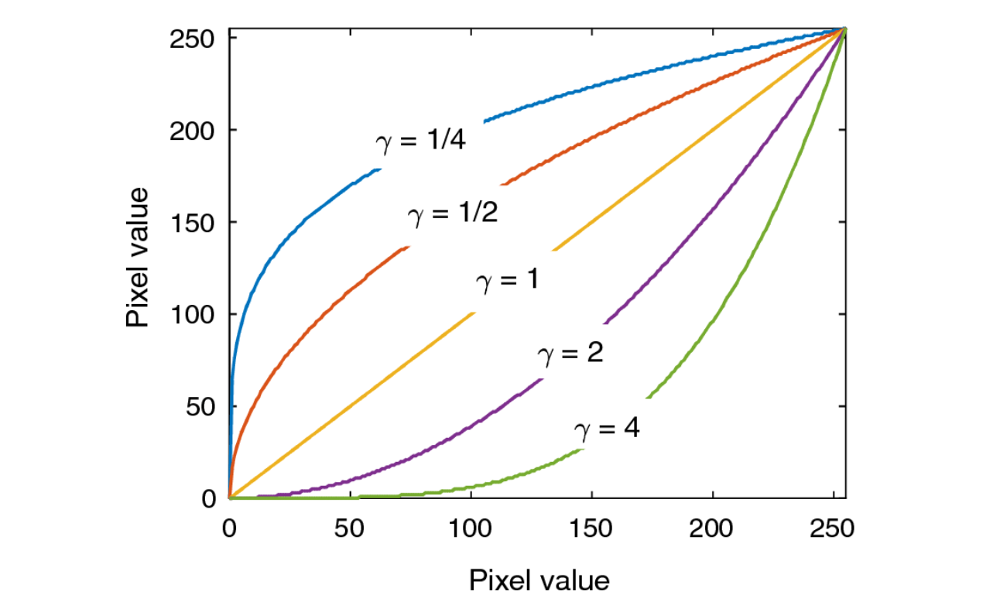
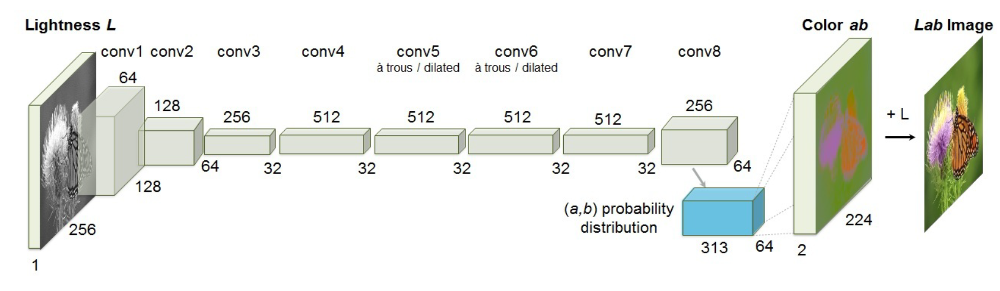

在这一节里，我们将讨论计算摄影的问题。传感器获取的照片往往不是最终的结果，我们需要对其进行进一步的处理来得到最终的好看的结果。

## High Dynamic Range Imaging (HDR) 高动态范围成像

在拍摄夜景的过程中，我们时常注意到，画面中的很多部分会出现过曝的情形，而有些部分则会同时出现曝光不足的情形。为了处理这些问题，我们首先需要了解曝光相关的知识。

曝光一般由三个因素决定，分别是增益、光强度和曝光时间。增益是在光电信号转换时发生的，它一般由 ISO 控制；光强度则一般由环境光照和光圈大小决定；曝光时间一般由快门的时间决定。

对于光圈和快门的知识我们在第一节中已经有所提及，这里主要提及一下感光度（ISO），这是在光信号和电信号转换的过程中发生的过程。如下图，它是在 A/D 转换的过程中发生的。ISO 太大的话，生成的图片中的噪点会越多。

我们在拍摄的时候往往会希望曝光是合适的、不会隐藏亮部和暗部的细节，但是这并不往往是容易的。我们称图像中（亮度）最大值和最小（非零）值的比值为动态范围（dynamic range）。相机的动态范围往往是 4096，远低于真实世界中可能存在的动态范围。因此，使用相机这么小的动态范围是难以覆盖真实世界的动态范围的，也就是说，亮部和暗部的细节往往不能完全保留。

为此，我们需要引入 HDR 的技术，它的思路并不复杂。如上所述，我们遇上的问题在于动态范围不够大，因此，我们通过改变 ISO 或者快门时间的方法拍摄多张不同曝光时间的图片，然后将其融合。这两步被称为 exposure bracketing 和 merging。

接下来我们仔细分析它的成像模型。我们知道，图片中的某个点的亮度等于空间中亮度乘以曝光加上噪声再进行剪裁之后的结果，即：

$$
I(x, y) = \mathrm{clip}(t_iL(x, y) + \mathrm{noise})
$$

于是，我们分三步完成整个过程，对于每个像素

1. 找到正确的图片中的像素亮度值，即没有欠曝光或者过曝光的那些像素值，即考虑 $(0.05, 0.95)$ 之间的亮度值（考虑噪声/剪裁的问题）；
2. 确定正确的权重。每个像素的权重需要设为曝光时间的倒数，这相当于对曝光时间的归一化；
3. 做加权平均得到最终的像素值

这样我们就得到了一张兼具亮部细节和暗部细节的图像。

当然，我们需要保证，合成之后得到的图像动态范围依旧是足够大的，但是，我们又要把它放到一个标准动态范围的图像文件之中，这个过程在相机处理过程中叫做色调变换（tone mapping/reproduction，见上图）。

色调变换有很多方法。最简单的方法当然是线性压缩，这样无法保持原有的细节。因此我们要做一个非线性的形式，我们称之为 Gamma 校正：

$$
y = ax^\gamma
$$

确定 $\gamma$ 之后 $a$ 就由归一化条件确定了。它的图像直观地如下图：

其中 $\gamma < 1$ 的情形提升暗部细节，$\gamma > 1$ 的情形提升亮部细节。对于自然图像的处理，我们往往会使用提升暗部细节的情形，因为自然情况下亮部的细节往往会比较少。

## Deblurring 去模糊

图像往往会出现模糊的情形。模糊的原因我们之前也已经提到过，主要的两种原因是失焦（defocus）和运动模糊（motion blur）。为了获得更加清晰的照片，我们往往需要在硬件层面做一些工作，例如更加精确地对焦，加快快门速度（伴随增大光圈、提升 ISO 等等），使用三脚架等辅助设备。

为了做到软件上的去模糊，我们首先需要建立数学模型来描述模糊。注意到，不管是运动模糊还是失焦模糊，同一张图片中各个局部光斑的形状都是类似的。因此我们认为它是一张图片经过一张模糊核的卷积之后得到的结果。在失焦的情形下，模糊核取决于光圈的形状，而在运动模糊的情形下，模糊核取决于相机运动的方向。于是，图像去模糊的问题就被转化为了一个去卷积的问题。

去卷积的问题设定有两种，一种预先知道模糊核，称为非盲去卷积（non-blind image deconvolution, NBID）；另一种模糊核未知，称为盲去卷积（blind image deconvolution, BID）。我们首先来看第一种情形，也就是模糊核已知的情形。

假设 $G$ 为结果图像 $H$ 为模糊核，$F$ 为需要求解的图像，满足 $G = F \otimes H$。这个方程的解并不难求，但是还有一种更简单的方法。利用卷积定理：

$$
FFT(G) = FFT(F \otimes H) = FFT(F)FFT(H)
$$

只要将其除过去就可以：

$$
F = IFFT(FFT(G) / FFT(H))
$$

这个过程通常被称为反向滤波（inverse filter）。

但是，当我们观察结果时，注意到模糊半径越大，效果就变得越差。因为反向滤波的过程会放大原先图片中的噪声。模糊核往往是低通滤波，而反向滤波会放大高频噪声。考虑：

$$
G(u, v) = H(u, v)F(u, v) + N(u, v)
$$

求得：

$$
\hat F(u, v) = F(u, v) + N(u, v) / H(u, v)
$$

$H(u, v)$ 太小时这是危险的。因此，我们采用另外一种优化方法，令：

$$
\hat F(u, v) = \frac {H^*(u, v)G(u, v)}{|H(u, v)|^2 + K(u, v)}
$$

这种滤波的方式被称为 Wiener 滤波。其中 $K(u, v)$ 为一个用来抑制噪声的常数，需要大小适中。

当然，我们可以将这个问题变成一个优化问题，目标函数就是一个 MSE：

$$
\Vert G - F \otimes H\Vert_2^2
$$

也就是去模糊的图像模糊之后的结果和给出图像越接近越好。但是，我们发现这个问题的解不唯一，因为模糊的过程损失了原始图片中的一些信息，直观地如图所示：

我们通过正则项的加入来解决这种问题。对于好的自然图像，我们要求它是比较光滑的，也就是说，它的梯度图应该是稀疏的，如下图所示。因此，一个很常用的正则项是梯度图的 $L_1$ 约束，使得梯度图变得稀疏。 

因此，我们的损失函数就变成了：

$$
\Vert G - F \otimes H \Vert_2^2 + \Vert\nabla F\Vert_1
$$

这样就可以解决前面的问题了。

对于盲去卷积的情形，我们的卷积核也是未知的。这是我们依然可以采用优化问题的方法，同时优化 $F$ 和 $H$ 的结果。这时我们为了防止它变得多解，又需要对卷积核做一个正则项，也就是说：

$$
\Vert G - F \otimes H \Vert_2^2 + \lambda_1\Vert\nabla F\Vert_1 + \lambda_2 \Vert H\Vert_1, \mathrm{\ s.t.\ } H \geqslant 0
$$

稀疏项的引入主要是考虑运动模糊的情形。

## Colorization 着色

世界上最早的一张彩色照片是由 Maxwell 在 1861 年拍摄的。但是，直到 1970 年，彩色照片也不是那么普及的，很多历史性照片都是黑白的。因此，我们希望对黑白照片进行着色，使得它变成彩色的。

灰度图像上色主要有两种方法。一种是基于样本的（sample-based），将样本图片的颜色迁移到灰度图像上；另一种是交互式的（interactive），通过用户的引导来进行着色。基于样本的着色的思路非常简单，就是寻找在样本图片中的对应的像素，然后将这个像素的颜色迁移过来。对应像素的寻找有一些传统的方法，例如亮度、邻域内标准差等，也有一些新方式，例如描述子或一些基于学习的想法。

交互式的上色的想法就是进行半自动的图像分割。在分割的过程中，我们为每个像素赋一个标签；而在上色的过程中，我们为每个像素赋一个 RGB 值。因此，我们将上色问题转变成优化问题，要最小化：

$$
J(r) = \sum_r(U(r) - \sum_{s \in N_r} w_{rs}U(s))
$$

其中 $w_{rs}$ 是差异造成的权重。但是这个函数是由平凡解（颜色完全均一）的，因此需要一些用户给的结果来作为约束条件。

对于视频的情形，我们需要优化的值变成了三维邻域内的东西，我们同样可以使用这种优化方式来扩散，只要在其中选择一定间隔之后的帧来进行插值即可。

利用神经网络也可以完成这个过程。我们使用如下全卷积网络来完成这个过程。

我们需要构造的重建损失则是：

$$
L(\Theta) = \Vert F(X; \Theta) - Y \Vert^2
$$

也就是前后图像的差值。训练数据是很容易得到的，因为我们可以很容易的将一个彩色图转成灰度图。

但是，这个重建损失是有问题的。着色事实上应该是多解的。例如，输入一只猫，它可以输出黑猫白猫或者黄猫，只要它是合理的就是可行的。反映到训练数据中，我们要求了对于相似数据的不同输出，那么训练的结果就会出现一些问题。这种情况下我们的网络收敛非常困难。另外一个问题是，这不能描述图像的真实性和清晰性。例如，一张模糊的图像很容易骗过这个损失函数，使得它的结果显得很好。

于是我们使用另外一种方式，我们直接学习一个损失函数，这就导致了一种被称为生成对抗网络（generative adversarial network, GAN）的架构的出现。我们的损失函数利用一个分类器网络来进行。这个分类器会判别生成图像和真实图像。利用这个东西，就可以将其作为一个对生成器的监督设施。

对于判别器而言，我们希望去做：

$$
\mathbf{E}(x, y) [\log(D(G(x))) + \log(1-D(y))]
$$

的最大化，其中 $D$ 为判别器，$G$ 为生成器。对于生成器而言，我们则要最大化这个参数。于是对于 GAN 而言，我们需要对两组变量进行同时优化，这种问题一般称为 Min-Max Problem。这种训练事实上是很难收敛的。于是，也产生了一些新的图像合成方法，例如 VAE 和扩散模型（diffusion model）等，它们可以解决它训练不稳定的问题。

注意到，我们训练出来的判别器其实是一个相当好的损失函数。这个判别器可以被使用到其它的任务上去。这个函数被称为对抗损失函数（adversarial loss）。

还有更多可能的图片合成任务。例如图像到图像的转换（image to image translation）。其中最经典的工作是一个 pix2pix。还有风格迁移（style transfer）、文本转图片（text-to-photo）、图像去雾（dehaze）等等，CycleGAN 也是一个比较著名的工作。

超分辨率（super-resolution）就是将一个低分辨率的图像转化成一个高分辨率的图像而不影响其清晰度。利用 GAN 也可以完成这个过程：

???+ error
    未完成！